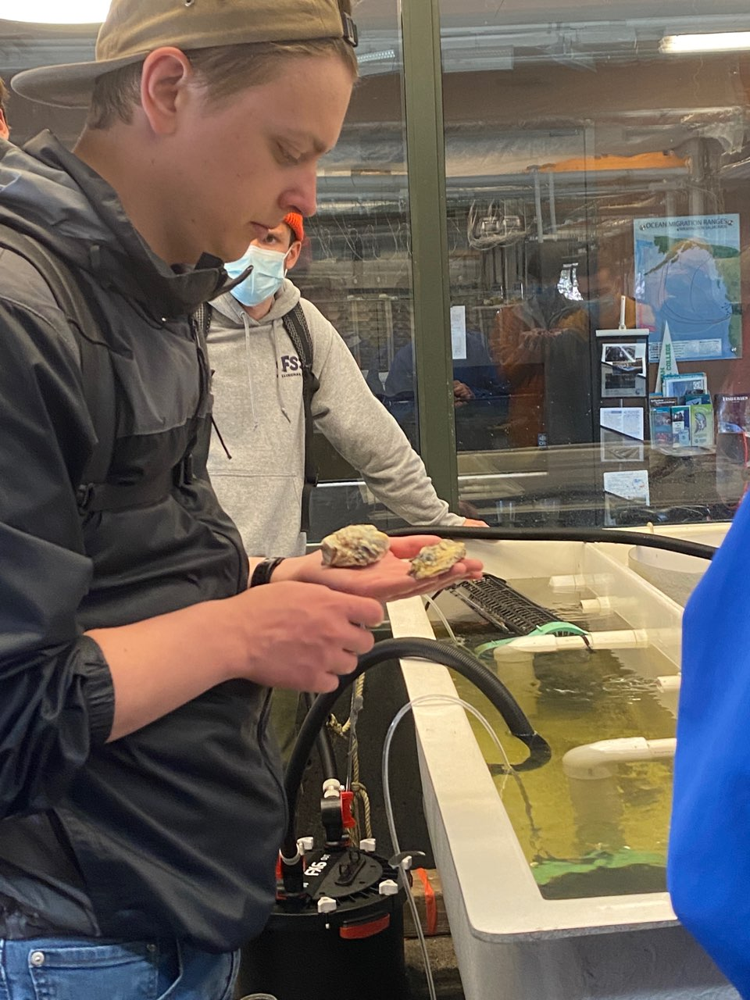

# Samuel Robinson

## Education
1. Edmonds College ([EdC](https://www.edmonds.edu/)) - A.S. Biology (June 2021)
2. Western Washington University ([WWU](https://www.wwu.edu/)) - B.S. Marine and Coastal Sciences (December 2023)
## Research Interests
1. Carbon Cycling
2. Thermohaline Circulation
3. Ecosytem Modeling
4. Recreating Past Envrionments
5. Paleoecology Modeling